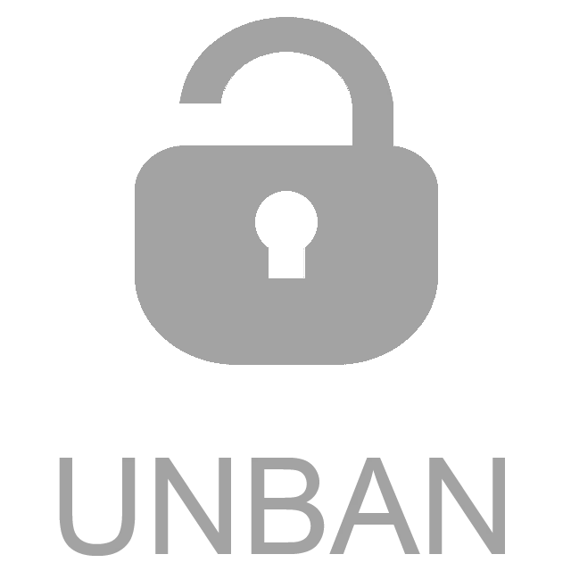

# telegram-unban-removed-users-bot

Telegram System Message Deleter Bot is an effective, self-hosted filter bot specifically crafted for Telegram groups.
Setting it up is straightforward as a Docker container, needing just a Telegram token and a group name or ID for the
user to get started. Once activated, bot oversees deleted users, and unban user (delete user from removed users list).

<div align="center">
  
</div>

## Configuration

All the configuration is done via environment variables.

There are some mandatory parameters what has to be set:

- `TELEGRAM_TOKEN` - telegram bot token. See below how to get it.
- `ADMIN_GROUP_ID` - group name/id. This can be a group name (for public groups it will look like `mygroup`) or group
  id (for private groups it will look like `-123456789`). To get the group id you can
  use [this bot](https://t.me/myidbot) or others like it.

As long as theses two parameters are set, the bot will work. Don't forget to add the bot to the group as an admin,
otherwise it will not be able to delete messages.

## Setting up the telegram bot

### Getting the token

To get a token, talk to [BotFather](https://core.telegram.org/bots#6-botfather). All you need is to send `/newbot`
command and choose the name for your bot (it must end in `bot`). That is it, and you got a token which you'll need to
write down into remark42 configuration as `TELEGRAM_TOKEN`.

_Example of such a "talk"_:

```
Systemnick:
/newbot

BotFather:
Alright, a new bot. How are we going to call it? Please choose a name for your bot.

Systemnick:
example_comments

BotFather:
Good. Now let's choose a username for your bot. It must end in `bot`. Like this, for example: TetrisBot or tetris_bot.

Systemnick:
example_comments_bot

BotFather:
Done! Congratulations on your new bot. You will find it at t.me/example_comments_bot. You can now add a description,
about section and profile picture for your bot, see /help for a list of commands. By the way, when you've finished
creating your cool bot, ping our Bot Support if you want a better username for it. Just make sure the bot is fully
operational before you do this.

Use this token to access the HTTP API:
12345678:xy778Iltzsdr45tg
```
